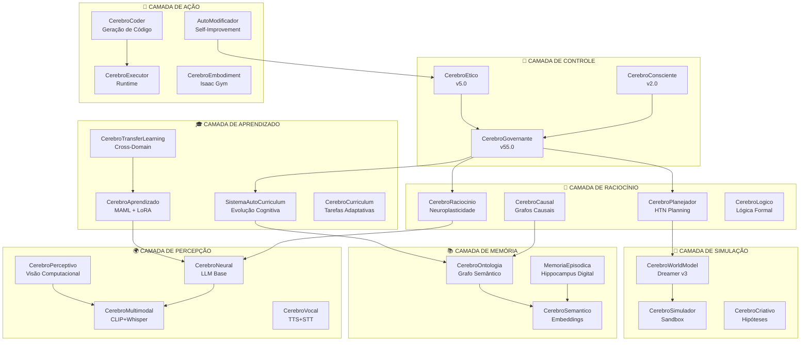
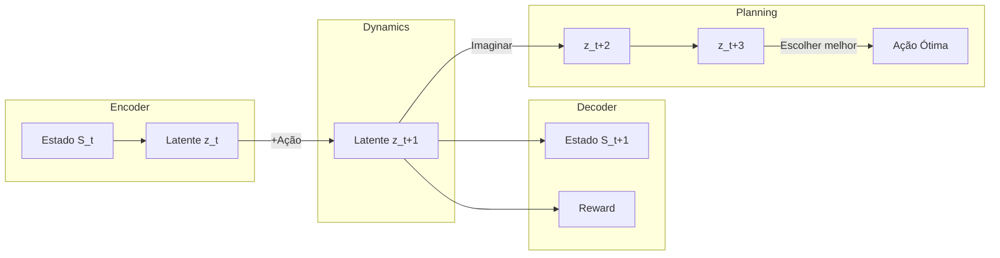
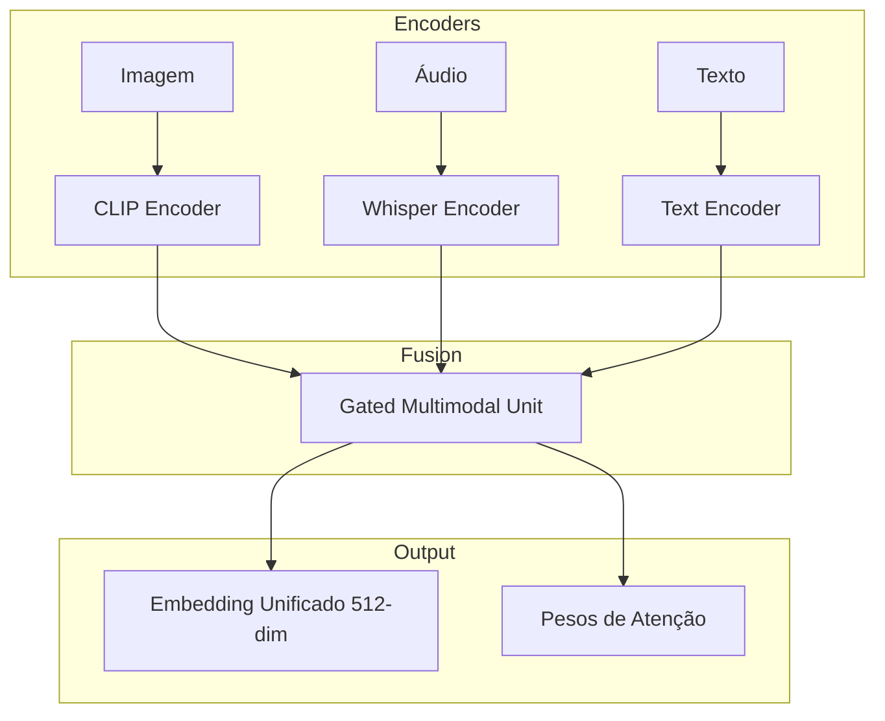
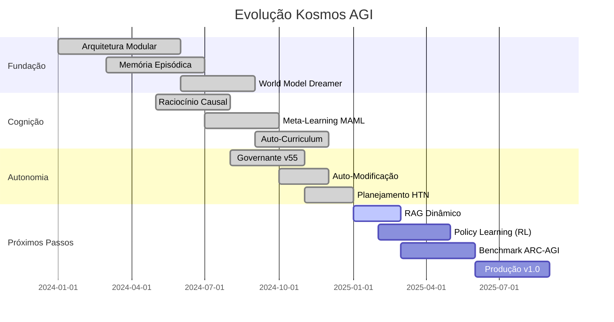

# 🧠 KOSMOS
## Plataforma Modular de uma proto Inteligência Artificial Geral

<div align="center">


**A próxima geração de sistemas de IA autônomos**

</div>

---

## 📋 Sumário Executivo

**Kosmos** é um protótipo de Inteligência Artificial Geral modular, desenvolvida com arquitetura cognitiva inspirada no cérebro human, o sistema integra **32+ módulos especializados** que trabalham de forma coordenada para permitir aprendizado contínuo, raciocínio causal, memória de longo prazo e tomada de decisão autônoma.

### 🎯 Proposta de Valor

| Diferencial | Descrição |
|-------------|-----------|
| **Autonomia Real** | Sistema que cria, prioriza e executa tarefas sem intervenção humana |
| **Memória Persistente** | Conhecimento preservado entre sessões via grafo + ontologia |
| **Auto-Evolução** | Capacidade de melhorar seu próprio código de forma controlada |
| **Multimodal** | Processamento unificado de texto, imagem e áudio |

---

## 🏗️ Arquitetura do Sistema



---

## 🧩 Módulos Principais

### 🎛️ Sistema de Controle Autônomo

#### CerebroGovernante v55.0
O **cérebro executivo** do sistema. Coordena todos os outros módulos.

```
┌─────────────────────────────────────────────────────────────────┐
│  CICLO DE METACONTROLE                                          │
├─────────────────────────────────────────────────────────────────┤
│  1. Recebe input (usuário ou autônomo)                          │
│  2. Verifica conflitos com objetivos persistentes               │
│  3. Consulta World Model para avaliar ações                     │
│  4. Decide próxima ação                                         │
│  5. Executa e registra resultado                                │
│  6. Aprende com feedback                                        │
└─────────────────────────────────────────────────────────────────┘
```

**Capacidades:**
- ✅ Objetivos persistentes com inércia (resistem a instruções conflitantes)
- ✅ Criação autônoma de novas tarefas
- ✅ Planejamento imaginativo via World Model
- ✅ Evolução cognitiva automática a cada X ciclos
- ✅ Pesquisa web autônoma
- ✅ Execução de comandos do sistema

---

### 🧠 Sistema de Memória

#### MemoriaEpisodica v1.0
Inspirada na arquitetura **Hippocampus → Neocortex**.

```
┌──────────────────────────────────────────────────────────────────┐
│  ARQUITETURA DE MEMÓRIA                                          │
├──────────────────────────────────────────────────────────────────┤
│                                                                  │
│  ┌─────────────────┐         ┌─────────────────┐                 │
│  │   BUFFER        │  ───►   │  ARQUIVO        │                 │
│  │   CURTO PRAZO   │ consol. │  LONGO PRAZO    │                 │
│  │  (100 episódios)│         │  (JSONL + Neo4j)│                 │
│  └─────────────────┘         └─────────────────┘                 │
│                                                                  │
│  • Embeddings SBERT (384-dim)                                    │
│  • Busca por similaridade semântica                              │
│  • Consolidação durante "sono"                                   │
│  • Replay de experiências importantes                            │
└──────────────────────────────────────────────────────────────────┘
```

#### CerebroOntologia v1.0
Sistema de **conhecimento ancorado** onde cada conceito possui:

|        Atributo         |            Descrição            |
|-------------------------|---------------------------------|
| Embedding               | Vetor 384-dim via Sentence-BERT |
| Definição               | Texto explicativo               |
| Exemplos                | 2+ instâncias concretas         |
| Relações                | Links para outros conceitos     |
| Affordances             | O que o objeto "permite fazer"  |
| Propriedades Físicas    | Atributos mensuráveis           |

**Nível de compreensão calculado automaticamente!**

---

### 🔮 World Model (Dreamer v3)

Modelo preditivo do mundo baseado em **Dreamer v3 (Hafner et al., 2023)**.



**Capacidades:**
- 🔮 Prever consequências de ações ANTES de executar
- 📊 Avaliar risco e reward esperado
- 🎯 Planejamento por busca no espaço latente
- 💾 Replay buffer de 100k transições

---

### 🎓 Sistema de Aprendizado

#### Meta-Learning (MAML + LoRA)

```
┌──────────────────────────────────────────────────────────────────┐
│  APRENDIZADO FEW-SHOT                                            │
├──────────────────────────────────────────────────────────────────┤
│                                                                  │
│  Problema: Aprender nova tarefa com POUCOS exemplos              │
│                                                                  │
│  Solução Kosmos:                                                 │
│  ┌─────────────┐    ┌─────────────┐    ┌─────────────┐           │
│  │    MAML     │ +  │    LoRA     │ =  │  Adaptação  │           │
│  │ (Meta-Learn)│    │ (Efficient) │    │   RÁPIDA    │           │
│  └─────────────┘    └─────────────┘    └─────────────┘           │
│                                                                  │
│  • 3-5 exemplos → Novo comportamento                             │
│  • Fine-tuning em segundos (não horas)                           │
│  • Preserva conhecimento anterior (EWC)                          │
└──────────────────────────────────────────────────────────────────┘
```

#### Auto-Curriculum (Evolução Cognitiva)

Sistema de **seleção natural interna** para conhecimento:

```
PROPOSTA → VALIDAÇÃO EPISTÊMICA → PROMOÇÃO CONDICIONAL → CONSOLIDAÇÃO
           ┌──────────────────┐   ┌──────────────────────┐
           │ • Novidade       │   │ • Generaliza?        │
           │ • Reduz incerteza│   │ • Não degrada?       │
           │ • Consistente?   │   │ • Baixa entropia?    │
           │ • Transferível?  │   │ • Anti-loop?         │
           └──────────────────┘   └──────────────────────┘
```

---

### 🔗 Raciocínio Causal

#### CerebroCausal v1.0

Diferencia **correlação de causalidade** usando:

| Teste | Descrição |
|-------|-----------|
| **Temporal** | Causa precede efeito |
| **Contrafactual** | "Se A não ocorresse, B ocorreria?" |
| **Mecanismo** | Existe explicação física/lógica? |

```python
# Exemplo de uso
resultado = cerebro_causal.analisar_causalidade(
    "chuva", 
    "rua molhada"
)
# {"causal": True, "confianca": 0.95, "mecanismo": "precipitação→superfície"}
```

---

### 🎨 Fusão Multimodal

#### CerebroMultimodalFusion v1.0

Combina **CLIP + Whisper + Texto** com **Gated Attention**.



**Aprende dinamicamente qual modalidade priorizar!**

---

### 🤖 Auto-Modificação Controlada

#### AutoModificador v1.0

O sistema pode **melhorar seu próprio código**, mas com proteções:

```
┌──────────────────────────────────────────────────────────────────┐
│  FLUXO DE AUTO-MODIFICAÇÃO                                       │
├──────────────────────────────────────────────────────────────────┤
│                                                                  │
│  ✅ PERMITIDO:                    ❌ BLOQUEADO:                 │
│  • Criar novos primitivos         • Modificar cerebro_etico.py   │
│  • Adicionar funções              • Remover funções críticas     │
│  • Otimizar código existente      • Bypass de segurança          │
│  • Expandir ontologia             • Modificar main.py            │
│                                                                  │
│  Workflow:                                                       │
│  PROPOSTA → SIMULAÇÃO → AVALIAÇÃO RISCO → APROVAÇÃO → EXECUÇÃO   │
│                 ↓              ↓                                 │
│             Sandbox        0.0-1.0                               │
│             (testa)        (score)                               │
└──────────────────────────────────────────────────────────────────┘
```

---

## 📊 Métricas de Capacidade

### Comparativo AGI

|       Capacidade        |      Status      |            Implementação            |
|-------------------------|------------------|-------------------------------------|
| Generalização           | 🟡 Parcial      | Meta-learning + Transfer Learning   |
| Memória Longo Prazo     | 🟢 Implementado | Episódica + Ontologia + Neo4j       |
| Raciocínio Causal       | 🟢 Implementado | Grafos causais + Contrafactuais     |
| Planejamento Hierárquico| 🟢 Implementado | HTN + World Model                   |
| Autonomia               | 🟢 Implementado | Governante + Objetivos Persistentes |
| Meta-Cognição           | 🟢 Implementado | Consciente + Self-Model             |
| Auto-Melhoria           | 🟡 Controlado   | AutoModificador + Sandbox           |
| Multimodal              | 🟢 Implementado | CLIP + Whisper + GMU                |
| Embodiment              | 🟡 Experimental | Isaac Gym (WSL2)                    |

### Inventário de Módulos

```
TOTAL: 32+ Módulos Ativos

CONTROLE (3):       RACIOCÍNIO (4):      MEMÓRIA (3):
├─ Governante       ├─ Raciocínio        ├─ Episódica
├─ Ético            ├─ Causal            ├─ Ontologia
└─ Consciente       ├─ Planejador        └─ Semântico
                    └─ Lógico

APRENDIZADO (4):    PERCEPÇÃO (4):       AÇÃO (4):
├─ Aprendizado      ├─ Neural            ├─ Coder
├─ Transfer         ├─ Multimodal        ├─ Executor
├─ AutoCurriculum   ├─ Perceptivo        ├─ Embodiment
└─ Curriculum       └─ Vocal             └─ AutoModificador

SIMULAÇÃO (3):      ESPECIALISTAS (7+):
├─ WorldModel       ├─ Criativo
├─ Simulador        ├─ Cientista
└─ Composicional    ├─ Financeiro
                    ├─ Linguístico
                    ├─ Indutor
                    ├─ Curiosidade
                    └─ TeoriaDaMente
```

---

## 🚀 Roadmap



---

## 💰 Oportunidade de Investimento

### Mercado

|      Segmento      | TAM (2025) | CAGR |
|--------------------|------------|------|
| AGI Research       |    $15B    |  35% |
| Enterprise AI      |    $180B   |  25% |
| Autonomous Systems |    $75B    |  30% |

### Diferenciais Competitivos

| Aspecto     |           Kosmos           | Concorrentes Típicos |
|-------------|----------------------------|----------------------|
| Arquitetura | Modular (32+ cérebros)     | Monolítica           |
| Memória     | Persistente (Neo4j + JSONL)| Limitada ao contexto |
| Autonomia   | Objetivos de longo prazo   | Reativa              |
| Evolução    | Auto-modificação controlada| Fixa                 |
| Custo       | Open-source base           | Proprietário         |

### Uso de Recursos

```
┌─────────────────────────────────────────────────────────────────┐
│  ALOCAÇÃO DO INVESTIMENTO                                       │
├─────────────────────────────────────────────────────────────────┤
│                                                                 │
│  40% │████████████████████│ Infraestrutura (GPU, Cloud)         │
│  25% │█████████████       │ P&D (RAG, RL, Benchmarks)           │
│  20% │██████████          │ Equipe (AI Researchers)             │
│  15% │███████             │ Operações + Legal                   │
│                                                                 │
└─────────────────────────────────────────────────────────────────┘
```

---

## 📧 Contato

**Projeto Kosmos - Inteligência Artificial Geral**

Para mais informações técnicas ou discussões sobre investimento, entre em contato.

---

<div align="center">

*"O objetivo é simples, mudar este mundo."*

**Kosmos © 2024-2026**

</div>


